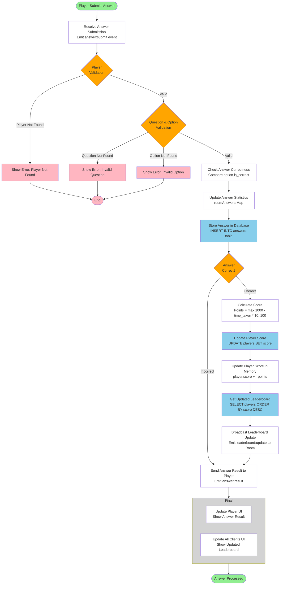

# Figure 4.5: Answer Processing and Leaderboard Workflow

## Overview

This diagram illustrates the workflow for processing player answers, calculating scores, updating the database, and broadcasting real-time leaderboard updates to all connected clients.



## Diagram Structure

**Shapes and Colors Legend:**
- **Ovals (Green)**: Start and End points of the workflow
- **Diamonds (Orange)**: Decision points for validation and flow control
- **Rectangles (White)**: General processing steps and WebSocket events
- **Rectangles (Pink)**: Error handling steps that terminate the process
- **Rectangles (Light Blue)**: Database storage operations
- **Large Grey Rectangle**: A grouping container for related final steps

## Workflow Steps

### 1. Player Submits Answer
- Player selects an answer option and clicks submit
- Answer submission triggered from player's client

### 2. Receive Answer Submission
- **Event**: `answer:submit` received by server
- **Payload**: `{ roomId, questionId, optionId, timeTaken }`
- Server receives answer data via WebSocket connection

### 3. Player Validation (Decision Point)
- **Player Not Found**: Player not in players Map → Shows error → Process ends
- **Valid**: Player exists and is registered in the room → Proceeds to question validation

### 4. Question & Option Validation (Decision Point)
- **Question Not Found**: Question ID doesn't exist in room questions → Shows error → Process ends
- **Option Not Found**: Option ID doesn't exist for the question → Shows error → Process ends
- **Valid**: Both question and option exist → Proceeds to check answer correctness

### 5. Check Answer Correctness
- Retrieve selected option from question options
- Compare `option.is_correct` with selected option
- Determine if answer is correct or incorrect

### 6. Update Answer Statistics
- Update `roomAnswers` Map in memory
- Increment count for selected option: `answerMap.set(optionId, count + 1)`
- Track answer distribution for statistics display

### 7. Store Answer in Database
- **SQL**: `INSERT INTO answers (room_id, question_id, player_id, option_id, is_correct, time_taken) VALUES ($1, $2, $3, $4, $5, $6)`
- Stores: room_id, question_id, player_id, option_id, is_correct flag, time_taken (milliseconds)
- Answer permanently stored for analytics and review

### 8. Answer Correct? (Decision Point)
- **Incorrect**: Answer is wrong → Skip scoring, send result to player
- **Correct**: Answer is correct → Proceeds to score calculation

### 9. Calculate Score
- **Formula**: `points = Math.max(1000 - timeTaken * 10, 100)`
- Faster answers receive more points
- Minimum points: 100 (if answered at last second)
- Maximum points: 1000 (if answered instantly)
- Example: 5 seconds = 1000 - (5 * 10) = 950 points

### 10. Update Player Score in Database
- **SQL**: `UPDATE players SET score = score + $1 WHERE id = $2`
- Player's total score incremented by calculated points
- Score updated in database for persistence

### 11. Update Player Score in Memory
- Update player object in `players` Map
- `player.score += points`
- Enables fast access for real-time updates

### 12. Get Updated Leaderboard
- **SQL**: `SELECT id, player_name, score FROM players WHERE room_id = $1 ORDER BY score DESC`
- Retrieve all players in room sorted by score (descending)
- Includes updated scores for all players

### 13. Broadcast Leaderboard Update
- **Event**: `leaderboard:update` emitted to all clients in room
- **Payload**: Array of players with updated scores, sorted by score
- All players (host and participants) receive real-time leaderboard update

### 14. Send Answer Result to Player
- **Event**: `answer:result` emitted to submitting player only
- **Payload**: `{ isCorrect, correctOptionId }`
- Player receives immediate feedback about their answer

### 15. Final Steps (Grouped)
- **Update Player UI**: Player sees if their answer was correct/incorrect
- **Update All Clients UI**: All clients see updated leaderboard with new scores

### 16. Answer Processed
- Answer processing complete
- All clients have updated information
- Process ready for next answer or question

---

## Score Calculation Details

### Formula Breakdown
```
points = Math.max(1000 - (timeTaken * 10), 100)
```

### Examples
| Time Taken (seconds) | Calculation | Points Awarded |
|---------------------|-------------|----------------|
| 0 | max(1000 - 0, 100) | 1000 |
| 5 | max(1000 - 50, 100) | 950 |
| 10 | max(1000 - 100, 100) | 900 |
| 20 | max(1000 - 200, 100) | 800 |
| 30 | max(1000 - 300, 100) | 700 |
| 90+ | max(1000 - 900+, 100) | 100 (minimum) |

### Scoring Rules
- **Only correct answers receive points**
- **Faster answers = more points** (encourages quick thinking)
- **Minimum points guaranteed** (100 points even at time limit)
- **Maximum points for instant answers** (1000 points)

---

## Database Operations

### Store Answer
```sql
INSERT INTO answers (
    room_id, 
    question_id, 
    player_id, 
    option_id, 
    is_correct, 
    time_taken
) VALUES ($1, $2, $3, $4, $5, $6)
```

**Parameters:**
- `$1`: room_id (VARCHAR)
- `$2`: question_id (INTEGER)
- `$3`: player_id (INTEGER)
- `$4`: option_id (INTEGER)
- `$5`: is_correct (BOOLEAN)
- `$6`: time_taken (INTEGER, milliseconds)

### Update Player Score
```sql
UPDATE players 
SET score = score + $1 
WHERE id = $2
```

**Parameters:**
- `$1`: points (INTEGER)
- `$2`: player_id (INTEGER)

### Get Leaderboard
```sql
SELECT id, player_name, score 
FROM players 
WHERE room_id = $1 
ORDER BY score DESC
```

**Parameters:**
- `$1`: room_id (VARCHAR)

---

## WebSocket Events

### Events Received by Server

| Event | From | Payload | Purpose |
|-------|------|---------|---------|
| `answer:submit` | Player | `{ roomId, questionId, optionId, timeTaken }` | Player submits answer |

### Events Emitted by Server

| Event | To | Payload | Purpose |
|-------|----|---------|---------|
| `answer:result` | Submitting Player | `{ isCorrect, correctOptionId }` | Confirm answer correctness |
| `leaderboard:update` | All in Room | `[{ id, player_name, score }, ...]` | Updated leaderboard |

---

## Error Handling

### Player Not Found
- **Cause**: Player socket not in players Map
- **Action**: Error logged, process terminates
- **User Impact**: No error shown (silent failure)

### Question Not Found
- **Cause**: Question ID doesn't match any question in room
- **Action**: Error logged, process terminates
- **User Impact**: No error shown (silent failure)

### Option Not Found
- **Cause**: Option ID doesn't match any option for the question
- **Action**: Error logged, process terminates
- **User Impact**: No error shown (silent failure)

### Database Errors
- **Cause**: Database connection or query failure
- **Action**: Error logged, process continues if possible
- **User Impact**: Answer may not be stored, but scoring continues

---

## Real-Time Updates Flow

### For Submitting Player
1. Receives `answer:result` event immediately
2. Sees if answer was correct/incorrect
3. Sees updated leaderboard via `leaderboard:update`

### For Other Players
1. Receive `leaderboard:update` event when any player scores
2. See updated rankings in real-time
3. No indication of who answered (privacy maintained)

### For Host
1. Receives all `leaderboard:update` events
2. Sees complete player list with scores
3. Can monitor quiz progress in real-time

---

## Key Components

| Component | Technology | Purpose |
|-----------|-----------|---------|
| **WebSocket Server** | Socket.IO | Real-time bidirectional communication |
| **In-Memory Storage** | JavaScript Maps | Fast access to players and statistics |
| **Database** | PostgreSQL | Persistent storage of answers and scores |
| **Scoring Algorithm** | Custom calculation | Points based on speed and correctness |

---

## Performance Considerations

### In-Memory Operations
- Answer statistics stored in `roomAnswers` Map for fast access
- Player scores updated in memory before database write
- Reduces database queries during active quiz

### Database Operations
- Answer stored immediately for data integrity
- Score update only for correct answers (reduces writes)
- Leaderboard query only when score changes

### Broadcasting
- Leaderboard broadcast only when score changes
- Individual result sent only to submitting player
- Efficient use of WebSocket bandwidth

