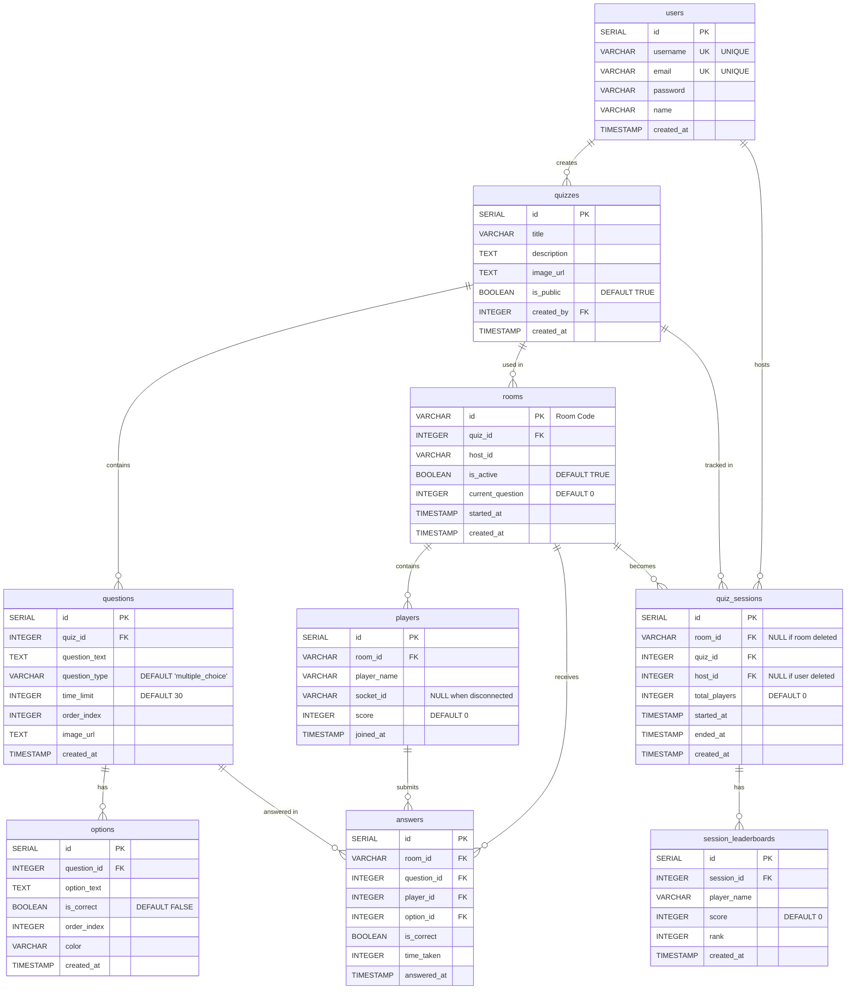

# Quiztastic Database Entity Relationship Diagram

## Entity Descriptions

### Core Entities

**users**
- Stores registered user accounts
- Authenticated users can create quizzes and host sessions

**quizzes**
- Stores quiz definitions created by users
- Can be public or private
- Contains metadata like title, description, and image

**questions**
- Stores individual questions within a quiz
- Has time limits and can include images
- Ordered by `order_index`

**options**
- Stores answer choices for each question
- One option per question is marked as correct
- Can have color coding for UI display

### Session Entities

**rooms**
- Represents active quiz sessions
- Identified by unique room codes (VARCHAR id)
- Tracks current question and active status

**players**
- Stores players participating in a room
- `socket_id` is NULL when player disconnects (preserved for analytics)
- Tracks individual scores

**answers**
- Records player responses to questions
- Links player, question, selected option, and room
- Stores correctness and time taken

### Analytics Entities

**quiz_sessions**
- Stores completed quiz session records
- Created when quiz ends or host leaves
- Links to room, quiz, and host for analytics

**session_leaderboards**
- Stores final leaderboard data for each session
- Preserves player names, scores, and ranks
- Used for historical analytics

## Relationships

- **users → quizzes**: One-to-many (user creates multiple quizzes)
- **users → quiz_sessions**: One-to-many (user hosts multiple sessions)
- **quizzes → questions**: One-to-many (quiz has multiple questions)
- **quizzes → rooms**: One-to-many (quiz can be used in multiple rooms)
- **quizzes → quiz_sessions**: One-to-many (quiz tracked in multiple sessions)
- **questions → options**: One-to-many (question has multiple options)
- **questions → answers**: One-to-many (question receives multiple answers)
- **rooms → players**: One-to-many (room contains multiple players)
- **rooms → answers**: One-to-many (room receives multiple answers)
- **rooms → quiz_sessions**: One-to-one (room becomes one session record)
- **players → answers**: One-to-many (player submits multiple answers)
- **quiz_sessions → session_leaderboards**: One-to-many (session has multiple leaderboard entries)

## Key Constraints

- **CASCADE DELETE**: Deleting a quiz deletes all related questions, options, rooms, and sessions
- **SET NULL**: Deleting a room sets `room_id` to NULL in quiz_sessions (preserves analytics)
- **SET NULL**: Deleting a user sets `host_id` to NULL in quiz_sessions (preserves analytics)
- **CASCADE DELETE**: Deleting a player deletes all their answers (but players are preserved for analytics)
- **UNIQUE**: Username and email must be unique per user
- **UNIQUE**: Room codes (id) must be unique

