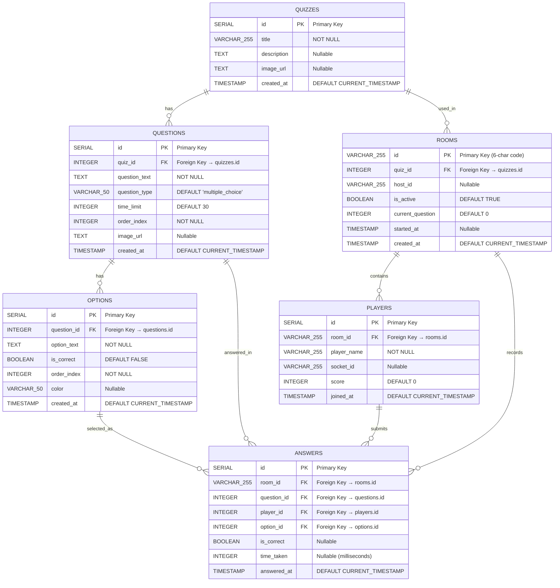

# Quiz App - Entity Relationship Diagram (ERD)

## Database Schema Overview

This document provides a detailed Entity Relationship Diagram showing all database entities, their attributes, data types, and relationships.



## Detailed Entity Descriptions

### 1. QUIZZES Entity

**Purpose**: Stores quiz metadata and basic information.

| Attribute | Data Type | Constraints | Description |
|-----------|-----------|-------------|-------------|
| `id` | SERIAL | PRIMARY KEY | Auto-incrementing unique identifier |
| `title` | VARCHAR(255) | NOT NULL | Quiz title/name |
| `description` | TEXT | NULL | Optional quiz description |
| `image_url` | TEXT | NULL | Optional image URL for quiz cover |
| `created_at` | TIMESTAMP | DEFAULT CURRENT_TIMESTAMP | Timestamp of quiz creation |

**Relationships**:
- **One-to-Many** with `QUESTIONS` (1 quiz has many questions)
- **One-to-Many** with `ROOMS` (1 quiz can be used in many game rooms)
- **Cascade Delete**: Deleting a quiz deletes all associated questions and rooms

---

### 2. QUESTIONS Entity

**Purpose**: Stores individual questions within a quiz.

| Attribute | Data Type | Constraints | Description |
|-----------|-----------|-------------|-------------|
| `id` | SERIAL | PRIMARY KEY | Auto-incrementing unique identifier |
| `quiz_id` | INTEGER | FOREIGN KEY, NOT NULL | References `quizzes.id` |
| `question_text` | TEXT | NOT NULL | The question content |
| `question_type` | VARCHAR(50) | DEFAULT 'multiple_choice' | Type of question |
| `time_limit` | INTEGER | DEFAULT 30 | Time limit in seconds |
| `order_index` | INTEGER | NOT NULL | Order of question in quiz |
| `image_url` | TEXT | NULL | Optional image URL for question |
| `created_at` | TIMESTAMP | DEFAULT CURRENT_TIMESTAMP | Timestamp of question creation |

**Relationships**:
- **Many-to-One** with `QUIZZES` (many questions belong to 1 quiz)
- **One-to-Many** with `OPTIONS` (1 question has many answer options)
- **One-to-Many** with `ANSWERS` (1 question can have many player answers)
- **Cascade Delete**: Deleting a question deletes all associated options and answers

---

### 3. OPTIONS Entity

**Purpose**: Stores answer choices/options for each question.

| Attribute | Data Type | Constraints | Description |
|-----------|-----------|-------------|-------------|
| `id` | SERIAL | PRIMARY KEY | Auto-incrementing unique identifier |
| `question_id` | INTEGER | FOREIGN KEY, NOT NULL | References `questions.id` |
| `option_text` | TEXT | NOT NULL | The option/choice text |
| `is_correct` | BOOLEAN | DEFAULT FALSE | Whether this option is the correct answer |
| `order_index` | INTEGER | NOT NULL | Order of option in question |
| `color` | VARCHAR(50) | NULL | Color identifier (red, blue, yellow, green) |
| `created_at` | TIMESTAMP | DEFAULT CURRENT_TIMESTAMP | Timestamp of option creation |

**Relationships**:
- **Many-to-One** with `QUESTIONS` (many options belong to 1 question)
- **One-to-Many** with `ANSWERS` (1 option can be selected in many answers)
- **Cascade Delete**: Deleting a question deletes all associated options

---

### 4. ROOMS Entity

**Purpose**: Represents active game sessions/rooms where quizzes are played.

| Attribute | Data Type | Constraints | Description |
|-----------|-----------|-------------|-------------|
| `id` | VARCHAR(255) | PRIMARY KEY | Unique room code (6-character string) |
| `quiz_id` | INTEGER | FOREIGN KEY, NOT NULL | References `quizzes.id` |
| `host_id` | VARCHAR(255) | NULL | Identifier for the host/creator |
| `is_active` | BOOLEAN | DEFAULT TRUE | Whether the room is currently active |
| `current_question` | INTEGER | DEFAULT 0 | Index of current question being shown |
| `started_at` | TIMESTAMP | NULL | Timestamp when quiz started |
| `created_at` | TIMESTAMP | DEFAULT CURRENT_TIMESTAMP | Timestamp of room creation |

**Relationships**:
- **Many-to-One** with `QUIZZES` (many rooms can use 1 quiz)
- **One-to-Many** with `PLAYERS` (1 room contains many players)
- **One-to-Many** with `ANSWERS` (1 room records many answers)
- **Cascade Delete**: Deleting a room deletes all associated players and answers

---

### 5. PLAYERS Entity

**Purpose**: Stores player information for active game sessions.

| Attribute | Data Type | Constraints | Description |
|-----------|-----------|-------------|-------------|
| `id` | SERIAL | PRIMARY KEY | Auto-incrementing unique identifier |
| `room_id` | VARCHAR(255) | FOREIGN KEY, NOT NULL | References `rooms.id` |
| `player_name` | VARCHAR(255) | NOT NULL | Display name of the player |
| `socket_id` | VARCHAR(255) | NULL | WebSocket connection identifier |
| `score` | INTEGER | DEFAULT 0 | Player's current score |
| `joined_at` | TIMESTAMP | DEFAULT CURRENT_TIMESTAMP | Timestamp when player joined |

**Relationships**:
- **Many-to-One** with `ROOMS` (many players belong to 1 room)
- **One-to-Many** with `ANSWERS` (1 player submits many answers)
- **Cascade Delete**: Deleting a room deletes all associated players

---

### 6. ANSWERS Entity

**Purpose**: Records player responses to quiz questions.

| Attribute | Data Type | Constraints | Description |
|-----------|-----------|-------------|-------------|
| `id` | SERIAL | PRIMARY KEY | Auto-incrementing unique identifier |
| `room_id` | VARCHAR(255) | FOREIGN KEY, NOT NULL | References `rooms.id` |
| `question_id` | INTEGER | FOREIGN KEY, NOT NULL | References `questions.id` |
| `player_id` | INTEGER | FOREIGN KEY, NOT NULL | References `players.id` |
| `option_id` | INTEGER | FOREIGN KEY, NULL | References `options.id` (selected option) |
| `is_correct` | BOOLEAN | NULL | Whether the answer was correct |
| `time_taken` | INTEGER | NULL | Time taken to answer (milliseconds) |
| `answered_at` | TIMESTAMP | DEFAULT CURRENT_TIMESTAMP | Timestamp when answer was submitted |

**Relationships**:
- **Many-to-One** with `ROOMS` (many answers recorded in 1 room)
- **Many-to-One** with `QUESTIONS` (many answers for 1 question)
- **Many-to-One** with `PLAYERS` (many answers from 1 player)
- **Many-to-One** with `OPTIONS` (many answers select 1 option)
- **Cascade Delete**: Deleting a room, question, or player deletes associated answers

---

## Relationship Summary

### Cardinality Relationships

1. **QUIZZES → QUESTIONS**: **One-to-Many (1:N)**
   - One quiz contains many questions
   - Each question belongs to exactly one quiz
   - **Cascade**: ON DELETE CASCADE

2. **QUIZZES → ROOMS**: **One-to-Many (1:N)**
   - One quiz can be used in many game rooms
   - Each room uses exactly one quiz
   - **Cascade**: ON DELETE CASCADE

3. **QUESTIONS → OPTIONS**: **One-to-Many (1:N)**
   - One question has many answer options
   - Each option belongs to exactly one question
   - **Cascade**: ON DELETE CASCADE

4. **ROOMS → PLAYERS**: **One-to-Many (1:N)**
   - One room contains many players
   - Each player belongs to exactly one room
   - **Cascade**: ON DELETE CASCADE

5. **ROOMS → ANSWERS**: **One-to-Many (1:N)**
   - One room records many answers
   - Each answer is recorded in exactly one room
   - **Cascade**: ON DELETE CASCADE

6. **QUESTIONS → ANSWERS**: **One-to-Many (1:N)**
   - One question receives many answers
   - Each answer responds to exactly one question
   - **Cascade**: ON DELETE CASCADE

7. **PLAYERS → ANSWERS**: **One-to-Many (1:N)**
   - One player submits many answers
   - Each answer is submitted by exactly one player
   - **Cascade**: ON DELETE CASCADE

8. **OPTIONS → ANSWERS**: **One-to-Many (1:N)**
   - One option can be selected in many answers
   - Each answer selects exactly one option (nullable)
   - **Cascade**: None (optional relationship)

---

## Data Integrity Rules

### Primary Keys
- All entities have a primary key (`id`) except `ROOMS` which uses a custom VARCHAR primary key
- Primary keys ensure uniqueness and provide fast lookups

### Foreign Keys
- All foreign key relationships enforce referential integrity
- Foreign keys prevent orphaned records

### Cascade Deletes
- **QUIZZES deletion**: Automatically deletes all QUESTIONS and ROOMS
- **QUESTIONS deletion**: Automatically deletes all OPTIONS and ANSWERS
- **ROOMS deletion**: Automatically deletes all PLAYERS and ANSWERS
- **PLAYERS deletion**: Automatically deletes all ANSWERS

### Constraints
- **NOT NULL constraints**: Ensure required data is present
- **DEFAULT values**: Provide sensible defaults for optional fields
- **UNIQUE constraints**: Room IDs must be unique (enforced by primary key)

---

## Indexes (Recommended)

For optimal performance, consider adding indexes on:

1. **QUESTIONS.quiz_id** - Frequently queried when loading quiz questions
2. **OPTIONS.question_id** - Frequently queried when loading question options
3. **PLAYERS.room_id** - Frequently queried for player lists
4. **ANSWERS.room_id** - Frequently queried for answer statistics
5. **ANSWERS.question_id** - Frequently queried for question statistics
6. **ANSWERS.player_id** - Frequently queried for player performance
7. **ROOMS.quiz_id** - Frequently queried when finding active rooms
8. **ROOMS.is_active** - Frequently queried for active room filtering

---

## Business Rules

1. **Quiz Structure**: A quiz must have at least one question, and each question must have at least one option
2. **Room Lifecycle**: A room is created for a specific quiz and can be active or inactive
3. **Player Participation**: Players join rooms and can only participate in one room at a time
4. **Answer Submission**: Each player can submit one answer per question per room
5. **Scoring**: Player scores are calculated based on correct answers and response time
6. **Room Codes**: Room IDs are unique 6-character codes generated using UUID

---

## Sample Queries

### Get Quiz with Questions and Options
```sql
SELECT q.*, 
       qn.id as question_id, qn.question_text, qn.time_limit,
       opt.id as option_id, opt.option_text, opt.is_correct, opt.color
FROM quizzes q
LEFT JOIN questions qn ON q.id = qn.quiz_id
LEFT JOIN options opt ON qn.id = opt.question_id
WHERE q.id = $1
ORDER BY qn.order_index, opt.order_index;
```

### Get Room with Players and Scores
```sql
SELECT r.*, 
       p.id as player_id, p.player_name, p.score
FROM rooms r
LEFT JOIN players p ON r.id = p.room_id
WHERE r.id = $1
ORDER BY p.score DESC;
```

### Get Answer Statistics for a Question
```sql
SELECT opt.option_text, opt.color,
       COUNT(a.id) as answer_count,
       SUM(CASE WHEN a.is_correct THEN 1 ELSE 0 END) as correct_count
FROM questions q
JOIN options opt ON q.id = opt.question_id
LEFT JOIN answers a ON opt.id = a.option_id AND a.question_id = q.id
WHERE q.id = $1
GROUP BY opt.id, opt.option_text, opt.color
ORDER BY opt.order_index;
```


