# Figure 4.4: Live Quiz Session Workflow

## Overview

This diagram illustrates the complete workflow for a live quiz session, from room creation through real-time question broadcasting, answer submission, scoring, and updates to all connected clients.

```mermaid
flowchart TD
    Start([Host Starts Live Quiz Session]) --> CreateRoom[Host Creates Room<br/>POST /api/room with quizId]
    
    CreateRoom --> LoadQuestions[Load Quiz Questions from Database<br/>Store in Memory]
    
    LoadQuestions --> CreateRoomDB[Create Room in Database<br/>INSERT INTO rooms]
    
    CreateRoomDB --> HostConnect[Host Establishes WebSocket<br/>Joins Room]
    
    HostConnect --> WaitPlayers[Wait for Players to Join<br/>Display Room Code]
    
    WaitPlayers --> PlayerConnect[Player Establishes WebSocket<br/>Connection]
    
    PlayerConnect --> PlayerJoin{Player Join<br/>Validation}
    
    PlayerJoin -->|Invalid| Error1[Show Error]
    PlayerJoin -->|Valid| StorePlayer[Store Player in Database<br/>INSERT INTO players]
    
    Error1 --> End([End])
    
    StorePlayer --> BroadcastJoin[Broadcast Player Joined<br/>to All Clients]
    
    BroadcastJoin --> HostStart{Host Starts<br/>Quiz?}
    
    HostStart -->|Not Started| WaitPlayers
    HostStart -->|Started| StartQuiz[Start Quiz Session<br/>Update Room Status]
    
    StartQuiz --> BroadcastQuestion[Broadcast Question<br/>Emit question:show]
    
    BroadcastQuestion --> WaitAnswers[Wait for Player Answers<br/>Timer Countdown]
    
    WaitAnswers --> AnswerValidation{Answer<br/>Received?}
    
    AnswerValidation -->|Time Expired| ShowAnswer[Show Correct Answer<br/>Display Statistics]
    AnswerValidation -->|Answer Received| ProcessAnswer[Process Answer<br/>Validate & Calculate Score]
    
    ProcessAnswer --> UpdateScore[Update Player Score<br/>Store Answer in Database]
    
    UpdateScore --> BroadcastLeaderboard[Broadcast Leaderboard<br/>Update to All Clients]
    
    BroadcastLeaderboard --> WaitAnswers
    
    ShowAnswer --> WaitInterval[Wait 3 Seconds]
    
    WaitInterval --> CheckQuestions{More<br/>Questions?}
    
    CheckQuestions -->|Yes| BroadcastQuestion
    CheckQuestions -->|No| EndQuiz[End Quiz Session<br/>Get Final Leaderboard]
    
    EndQuiz --> BroadcastEnd[Broadcast Quiz Ended<br/>Emit quiz:ended]
    
    BroadcastEnd --> Final[Final Results]
    
    subgraph Final
        ShowResults[Show Final Results<br/>Display Leaderboard]
        Disconnect[Disconnect WebSocket<br/>Connections]
    end
    
    Final --> Results([Show Quiz Results])
    
    style Start fill:#90EE90
    style CreateRoom fill:#FFFFFF
    style LoadQuestions fill:#87CEEB
    style CreateRoomDB fill:#87CEEB
    style HostConnect fill:#FFFFFF
    style WaitPlayers fill:#FFFFFF
    style PlayerConnect fill:#FFFFFF
    style PlayerJoin fill:#FFA500
    style Error1 fill:#FFB6C1
    style StorePlayer fill:#87CEEB
    style BroadcastJoin fill:#FFFFFF
    style HostStart fill:#FFA500
    style StartQuiz fill:#87CEEB
    style BroadcastQuestion fill:#FFFFFF
    style WaitAnswers fill:#FFFFFF
    style AnswerValidation fill:#FFA500
    style ShowAnswer fill:#FFFFFF
    style ProcessAnswer fill:#FFFFFF
    style UpdateScore fill:#87CEEB
    style BroadcastLeaderboard fill:#FFFFFF
    style WaitInterval fill:#FFFFFF
    style CheckQuestions fill:#FFA500
    style EndQuiz fill:#87CEEB
    style BroadcastEnd fill:#FFFFFF
    style Final fill:#D3D3D3
    style ShowResults fill:#FFFFFF
    style Disconnect fill:#FFFFFF
    style Results fill:#90EE90
    style End fill:#FFB6C1
```



## Diagram Structure

**Shapes and Colors Legend:**
- **Ovals (Green)**: Start and End points of the workflow
- **Diamonds (Orange)**: Decision points for validation and flow control
- **Rectangles (White)**: General processing steps and WebSocket events
- **Rectangles (Pink)**: Error handling steps that terminate the process
- **Rectangles (Light Blue)**: Database storage operations
- **Large Grey Rectangle**: A grouping container for related final steps

## Workflow Steps

### 1. Host Starts Live Quiz Session
- Host initiates a live quiz session and selects a quiz to host

### 2. Host Creates Room
- **REST API Call**: `POST /api/room` with `{ quizId, hostId }`
- Server generates unique 6-character room code

### 3. Load Quiz Questions from Database
- Server queries database for quiz questions and options
- Questions stored in memory (`roomQuestions` Map) for fast access

### 4. Create Room in Database
- **SQL**: `INSERT INTO rooms (id, quiz_id, host_id) VALUES ($1, $2, $3)`
- Room created with unique code, quiz ID, and host ID

### 5. Host Establishes WebSocket Connection
- Host client connects to Socket.IO server
- Host joins room via `host:join` event

### 6. Wait for Players to Join
- Host waits on quiz room page
- Room code displayed for players to join

### 7. Player Establishes WebSocket Connection
- Player client connects to Socket.IO server using room code

### 8. Player Join Validation (Decision Point)
- **Invalid**: Shows error → Process ends
- **Valid**: Proceeds to store player

### 9. Store Player in Database
- **SQL**: `INSERT INTO players (room_id, player_name, socket_id) VALUES ($1, $2, $3)`
- Player registered with room, name, and socket ID

### 10. Broadcast Player Joined
- **Event**: `player:joined` and `players:list` emitted to all clients
- Real-time update of player list

### 11. Host Starts Quiz? (Decision Point)
- **Not Started**: Returns to wait for more players
- **Started**: Host clicks "Start Quiz" button

### 12. Start Quiz Session
- **SQL**: `UPDATE rooms SET is_active = TRUE, started_at = CURRENT_TIMESTAMP`
- Room marked as active and quiz begins

### 13. Broadcast Question
- **Event**: `question:show` emitted to all clients in room
- Question data (text, options, time limit) sent to all players

### 14. Wait for Player Answers
- Players can select and submit answers
- Timer counts down from question time limit
- Server waits for answer submissions

### 15. Answer Received? (Decision Point)
- **Time Expired**: Auto-advances to show answer
- **Answer Received**: Processes the answer submission

### 16. Process Answer
- **Event**: `answer:submit` with `{ roomId, questionId, optionId, timeTaken }`
- Validates if selected option is correct
- **Calculate Score**: `points = Math.max(1000 - timeTaken * 10, 100)`

### 17. Update Player Score
- **SQL**: `UPDATE players SET score = score + $1 WHERE id = $2`
- **SQL**: `INSERT INTO answers (room_id, question_id, player_id, option_id, is_correct, time_taken) VALUES (...)`
- Score updated and answer stored in database

### 18. Broadcast Leaderboard Update
- **Event**: `leaderboard:update` emitted to all clients
- Real-time leaderboard shown to all players
- Returns to wait for more answers

### 19. Show Correct Answer
- **Event**: `answer:show` emitted to all clients
- Correct answer and statistics displayed to all players

### 20. Wait 3 Seconds
- Brief pause before next question
- Allows players to review answer and statistics

### 21. More Questions? (Decision Point)
- **Yes**: Returns to broadcast next question
- **No**: Ends quiz session

### 22. End Quiz Session
- **SQL**: `UPDATE rooms SET is_active = FALSE WHERE id = $1`
- **SQL**: `SELECT id, player_name, score FROM players WHERE room_id = $1 ORDER BY score DESC`
- Room marked inactive and final leaderboard retrieved

### 23. Broadcast Quiz Ended
- **Event**: `quiz:ended` emitted to all clients
- Final leaderboard sent to all players

### 24. Final Steps (Grouped)
- **Show Final Results**: Display leaderboard to all clients
- **Disconnect WebSocket**: Close WebSocket connections

### 25. Show Quiz Results
- Final leaderboard displayed
- Winner highlighted
- Process completes

---

## Real-Time Communication Events

### WebSocket Events Emitted by Server

| Event | Recipients | Purpose |
|-------|-----------|---------|
| `host:joined` | Host | Confirms host joined room |
| `players:list` | All in room | Updates player list |
| `player:joined` | All in room | Notifies new player joined |
| `quiz:started` | All in room | Signals quiz has started |
| `question:show` | All in room | Broadcasts current question |
| `answer:show` | All in room | Shows correct answer & statistics |
| `answer:result` | Individual player | Confirms answer correctness |
| `leaderboard:update` | All in room | Updates leaderboard |
| `quiz:ended` | All in room | Signals quiz completion |

### WebSocket Events Received by Server

| Event | From | Purpose |
|-------|------|---------|
| `host:join` | Host | Host joins room |
| `player:join` | Player | Player joins room |
| `quiz:start` | Host | Starts quiz session |
| `answer:submit` | Player | Player submits answer |
| `host:leave` | Host | Host leaves room |
| `player:leave` | Player | Player leaves room |
| `disconnect` | Any | Handles disconnection |

---

## Database Operations

### Room Management
```sql
-- Create room
INSERT INTO rooms (id, quiz_id, host_id) VALUES ($1, $2, $3)

-- Update room status
UPDATE rooms SET is_active = TRUE, started_at = CURRENT_TIMESTAMP, current_question = $1 WHERE id = $2

-- End room
UPDATE rooms SET is_active = FALSE WHERE id = $1
```

### Player Management
```sql
-- Add player
INSERT INTO players (room_id, player_name, socket_id) VALUES ($1, $2, $3)

-- Update player score
UPDATE players SET score = score + $1 WHERE id = $2

-- Get players
SELECT id, player_name, score FROM players WHERE room_id = $1 ORDER BY score DESC
```

### Answer Management
```sql
-- Store answer
INSERT INTO answers (room_id, question_id, player_id, option_id, is_correct, time_taken) 
VALUES ($1, $2, $3, $4, $5, $6)
```

---

## Key Technologies

| Component | Technology | Purpose |
|-----------|-----------|---------|
| **WebSocket Server** | Socket.IO | Real-time bidirectional communication |
| **WebSocket Client** | Socket.IO Client | Client-side WebSocket connection |
| **Database** | PostgreSQL | Persistent storage of rooms, players, answers |
| **In-Memory Storage** | JavaScript Maps | Fast access to questions and answers during session |
| **Scoring Algorithm** | Custom calculation | Points based on speed and correctness |

---

## Error Handling

- **Invalid Room Code**: Player cannot join, error displayed
- **Room Full**: Player cannot join, error displayed
- **Connection Lost**: Server handles disconnection, removes player from room
- **Host Disconnects**: Quiz ends automatically, final leaderboard sent
- **Player Disconnects**: Player removed from active players list

