# Figure 4.3: Quiz Creation Workflow

## Overview

This diagram illustrates the complete workflow for creating a quiz in the Quiz App, from initial user input through client-side validation, REST API submission, server processing, and database storage.

```mermaid
flowchart TD
    Start([Host Opens Create Quiz Page]) --> FillForm[Host Fills Quiz Form]
    
    FillForm --> EnterTitle[Enter Quiz Title]
    EnterTitle --> EnterDesc[Enter Description Optional]
    EnterDesc --> UploadQuizImage{Upload Quiz Image?}
    
    UploadQuizImage -->|Yes| ConvertQuizImage[Convert Image to Base64]
    UploadQuizImage -->|No| AddQuestions[Add Questions]
    ConvertQuizImage --> AddQuestions
    
    AddQuestions --> EnterQuestion[Enter Question Text]
    EnterQuestion --> SetTimeLimit[Set Time Limit]
    SetTimeLimit --> UploadQImage{Upload Question Image?}
    
    UploadQImage -->|Yes| ConvertQImage[Convert Question Image to Base64]
    UploadQImage -->|No| AddOptions[Add Answer Options]
    ConvertQImage --> AddOptions
    
    AddOptions --> EnterOption1[Enter Option 1 Text]
    EnterOption1 --> EnterOption2[Enter Option 2 Text]
    EnterOption2 --> EnterOption3[Enter Option 3 Text]
    EnterOption3 --> EnterOption4[Enter Option 4 Text]
    EnterOption4 --> MarkCorrect[Mark Correct Answer]
    
    MarkCorrect --> MoreQuestions{More Questions?}
    MoreQuestions -->|Yes| EnterQuestion
    MoreQuestions -->|No| ClickSubmit[Click Create Quiz Button]
    
    ClickSubmit --> ClientValidation{Client-Side Validation}
    
    ClientValidation -->|Title Empty?| TitleError[Show Error: Enter Quiz Title]
    TitleError --> FillForm
    
    ClientValidation -->|Question Text Empty?| QTextError[Show Error: Enter Question Text]
    QTextError --> FillForm
    
    ClientValidation -->|No Correct Answer?| CorrectError[Show Error: Select Correct Answer]
    CorrectError --> FillForm
    
    ClientValidation -->|Option Text Empty?| OptionError[Show Error: Fill All Options]
    OptionError --> FillForm
    
    ClientValidation -->|Validation Passed| PrepareData[Prepare Request Data]
    
    PrepareData --> ConvertAllImages[Convert All Images to Base64]
    ConvertAllImages --> BuildPayload[Build JSON Payload]
    
    BuildPayload --> RESTAPI[POST /api/quiz<br/>REST API Submission]
    
    RESTAPI --> HTTPRequest[HTTP Request via Axios<br/>Port 3000 → 5000]
    
    HTTPRequest --> ExpressServer[Express.js Server Receives Request]
    
    ExpressServer --> CORS[CORS Middleware]
    CORS --> JSONParser[JSON Body Parser]
    JSONParser --> RouteHandler[Quiz Route Handler<br/>POST /]
    
    RouteHandler --> ServerValidation{Server-Side Validation<br/>Zod Schema}
    
    ServerValidation -->|Validation Failed| ServerError[Return 500 Error<br/>Error Message]
    ServerError --> ClientError[Display Error Toast]
    ClientError --> End([End])
    
    ServerValidation -->|Validation Passed| StartTransaction[Begin Database Transaction]
    
    StartTransaction --> InsertQuiz[INSERT INTO quizzes<br/>title, description, image_url]
    InsertQuiz --> GetQuizId[Get Quiz ID from Result]
    
    GetQuizId --> LoopQuestions[Loop Through Questions]
    
    LoopQuestions --> InsertQuestion[INSERT INTO questions<br/>quiz_id, question_text,<br/>question_type, time_limit,<br/>order_index, image_url]
    InsertQuestion --> GetQuestionId[Get Question ID]
    
    GetQuestionId --> LoopOptions[Loop Through Options]
    
    LoopOptions --> InsertOption[INSERT INTO options<br/>question_id, option_text,<br/>is_correct, order_index,<br/>color]
    
    InsertOption --> MoreOptions{More Options?}
    MoreOptions -->|Yes| LoopOptions
    MoreOptions -->|No| MoreQuestionsDB{More Questions?}
    
    MoreQuestionsDB -->|Yes| LoopQuestions
    MoreQuestionsDB -->|No| CommitTransaction[Commit Transaction]
    
    CommitTransaction --> SuccessResponse[Return Success Response<br/>Quiz Object with ID]
    
    SuccessResponse --> ClientSuccess[Display Success Toast]
    ClientSuccess --> NavigateHome[Navigate to Home Page]
    NavigateHome --> End
    
    style Start fill:#e1f5ff
    style FillForm fill:#e1f5ff
    style EnterTitle fill:#e1f5ff
    style EnterDesc fill:#e1f5ff
    style UploadQuizImage fill:#e1f5ff
    style ConvertQuizImage fill:#e1f5ff
    style AddQuestions fill:#e1f5ff
    style EnterQuestion fill:#e1f5ff
    style SetTimeLimit fill:#e1f5ff
    style UploadQImage fill:#e1f5ff
    style ConvertQImage fill:#e1f5ff
    style AddOptions fill:#e1f5ff
    style EnterOption1 fill:#e1f5ff
    style EnterOption2 fill:#e1f5ff
    style EnterOption3 fill:#e1f5ff
    style EnterOption4 fill:#e1f5ff
    style MarkCorrect fill:#e1f5ff
    style ClickSubmit fill:#fff3e0
    style ClientValidation fill:#fff3e0
    style TitleError fill:#ffebee
    style QTextError fill:#ffebee
    style CorrectError fill:#ffebee
    style OptionError fill:#ffebee
    style PrepareData fill:#fff3e0
    style ConvertAllImages fill:#fff3e0
    style BuildPayload fill:#fff3e0
    style RESTAPI fill:#fff3e0
    style HTTPRequest fill:#fff3e0
    style ExpressServer fill:#f3e5f5
    style CORS fill:#f3e5f5
    style JSONParser fill:#f3e5f5
    style RouteHandler fill:#f3e5f5
    style ServerValidation fill:#f3e5f5
    style ServerError fill:#ffebee
    style StartTransaction fill:#e8f5e9
    style InsertQuiz fill:#e8f5e9
    style GetQuizId fill:#e8f5e9
    style LoopQuestions fill:#e8f5e9
    style InsertQuestion fill:#e8f5e9
    style GetQuestionId fill:#e8f5e9
    style LoopOptions fill:#e8f5e9
    style InsertOption fill:#e8f5e9
    style CommitTransaction fill:#e8f5e9
    style SuccessResponse fill:#e8f5e9
    style ClientSuccess fill:#e1f5ff
    style NavigateHome fill:#e1f5ff
    style End fill:#e1f5ff
```



## Detailed Workflow Steps

### Phase 1: User Input (Presentation Layer)

#### 1.1 Form Filling
- **Host opens Create Quiz page** (`/create` route)
- **Enter Quiz Metadata**:
  - Quiz Title (required)
  - Description (optional)
  - Quiz Cover Image (optional, drag & drop or file picker)

#### 1.2 Question Creation
- **Add Questions** (one or more):
  - Question Text (required)
  - Time Limit in seconds (default: 30)
  - Question Image (optional)
  
#### 1.3 Option Creation
- **Add Answer Options** (4 options per question):
  - Option Text (required for each)
  - Mark one option as correct answer
  - Options are color-coded (red, blue, yellow, green)

#### 1.4 Image Processing (Client-Side)
- **Image Conversion**:
  - Quiz images and question images are converted to Base64 format
  - Uses `FileReader.readAsDataURL()` API
  - Images are embedded in JSON payload

---

### Phase 2: Client-Side Validation

#### 2.1 Validation Rules
When the "Create Quiz" button is clicked, the following validations occur:

1. **Quiz Title Validation**:
   - Checks if title is not empty
   - Error: "Please enter a quiz title"

2. **Question Text Validation**:
   - Checks each question has non-empty text
   - Error: "Please enter question text for question X"

3. **Correct Answer Validation**:
   - Checks each question has at least one correct answer marked
   - Error: "Please select a correct answer for question X"

4. **Option Text Validation**:
   - Checks all options have non-empty text
   - Error: "Please fill all options for question X"

#### 2.2 Validation Failure
- If any validation fails:
  - Error toast notification is displayed
  - User remains on form to fix errors
  - No API request is sent

#### 2.3 Validation Success
- If all validations pass:
  - All images are converted to Base64
  - JSON payload is constructed
  - Proceeds to API submission

---

### Phase 3: REST API Submission

#### 3.1 Request Construction
**HTTP Method**: `POST`  
**Endpoint**: `http://localhost:5000/api/quiz`  
**Headers**: 
- `Content-Type: application/json`

**Request Body Structure**:
```json
{
  "title": "Quiz Title",
  "description": "Quiz Description",
  "image": "data:image/png;base64,iVBORw0KG...",
  "questions": [
    {
      "questionText": "What is...?",
      "questionType": "multiple_choice",
      "timeLimit": 30,
      "image": "data:image/png;base64,iVBORw0KG...",
      "options": [
        { "text": "Option 1", "isCorrect": false },
        { "text": "Option 2", "isCorrect": true },
        { "text": "Option 3", "isCorrect": false },
        { "text": "Option 4", "isCorrect": false }
      ]
    }
  ]
}
```

#### 3.2 HTTP Request
- **Axios Client** sends POST request
- **Vite Proxy** forwards request from port 3000 to 5000
- Request travels over HTTP/HTTPS protocol

---

### Phase 4: Server Processing (Application Layer)

#### 4.1 Request Reception
- **Express.js Server** receives HTTP request on port 5000
- **CORS Middleware** validates origin
- **JSON Body Parser** parses request body (limit: 50MB)

#### 4.2 Route Handling
- **Quiz Router** (`/api/quiz`) handles the request
- **POST Route Handler** processes the request

#### 4.3 Server-Side Validation
- **Zod Schema Validation** (if implemented):
  - Validates request structure
  - Validates data types
  - Validates required fields

#### 4.4 Error Handling
- If validation fails:
  - Returns HTTP 500 status
  - Returns error message in response
  - Client displays error toast
  - Process ends

---

### Phase 5: Database Storage (Data Layer)

#### 5.1 Transaction Start
- Database operations are performed sequentially
- Each operation uses the result from the previous one

#### 5.2 Quiz Insertion
**SQL Query**:
```sql
INSERT INTO quizzes (title, description, image_url) 
VALUES ($1, $2, $3) 
RETURNING *
```

**Parameters**:
- `$1`: Quiz title
- `$2`: Quiz description (or NULL)
- `$3`: Quiz image URL (Base64 string or NULL)

**Result**: Returns quiz record with auto-generated `id`

#### 5.3 Question Insertion Loop
For each question in the request:

**SQL Query**:
```sql
INSERT INTO questions 
  (quiz_id, question_text, question_type, time_limit, order_index, image_url) 
VALUES ($1, $2, $3, $4, $5, $6) 
RETURNING *
```

**Parameters**:
- `$1`: Quiz ID (from step 5.2)
- `$2`: Question text
- `$3`: Question type (default: 'multiple_choice')
- `$4`: Time limit in seconds
- `$5`: Order index (1, 2, 3, ...)
- `$6`: Question image URL (Base64 string or NULL)

**Result**: Returns question record with auto-generated `id`

#### 5.4 Option Insertion Loop
For each option in the current question:

**SQL Query**:
```sql
INSERT INTO options 
  (question_id, option_text, is_correct, order_index, color) 
VALUES ($1, $2, $3, $4, $5)
```

**Parameters**:
- `$1`: Question ID (from step 5.3)
- `$2`: Option text
- `$3`: Boolean indicating if option is correct
- `$4`: Order index (1, 2, 3, 4)
- `$5`: Color identifier ('red', 'blue', 'yellow', 'green')

#### 5.5 Transaction Completion
- All database operations complete successfully
- Quiz, questions, and options are stored with proper relationships
- Foreign key constraints ensure referential integrity

---

### Phase 6: Response & Client Update

#### 6.1 Success Response
- Server returns HTTP 200 status
- Response body contains quiz object with ID:
```json
{
  "id": 1,
  "title": "Quiz Title",
  "description": "Quiz Description",
  "image_url": "data:image/png;base64,...",
  "created_at": "2024-01-01T12:00:00Z"
}
```

#### 6.2 Client Success Handling
- **Success Toast** displayed: "Quiz created successfully!"
- **Navigation** to Home page (`/`)
- User can now see the new quiz in the quiz list

---

## Database Tables Involved

### 1. `quizzes` Table
- **Primary Key**: `id` (SERIAL)
- **Stored Data**: Title, description, image_url, created_at

### 2. `questions` Table
- **Primary Key**: `id` (SERIAL)
- **Foreign Key**: `quiz_id` → `quizzes.id`
- **Stored Data**: Question text, type, time limit, order, image_url

### 3. `options` Table
- **Primary Key**: `id` (SERIAL)
- **Foreign Key**: `question_id` → `questions.id`
- **Stored Data**: Option text, correctness flag, order, color

---

## Error Scenarios

### Client-Side Errors
1. **Validation Errors**: Caught before API call
2. **Image Conversion Errors**: Logged, quiz continues without image
3. **Network Errors**: Caught by Axios, error toast displayed

### Server-Side Errors
1. **Validation Errors**: HTTP 500 with error message
2. **Database Errors**: Transaction fails, error returned
3. **Constraint Violations**: Foreign key or unique constraint errors

---

## Data Flow Summary

```
User Input → Client Validation → Image Conversion → 
HTTP Request → Express Server → Database Transaction → 
Quiz Insert → Questions Insert → Options Insert → 
Success Response → Client Update → Navigation
```

---

## Technologies Used

- **Frontend**: React, TypeScript, Axios, FileReader API
- **Backend**: Express.js, TypeScript, PostgreSQL (pg library)
- **Validation**: Client-side checks, Zod (server-side)
- **Protocol**: HTTP/HTTPS (REST API)
- **Database**: PostgreSQL with SERIAL primary keys and foreign key constraints

