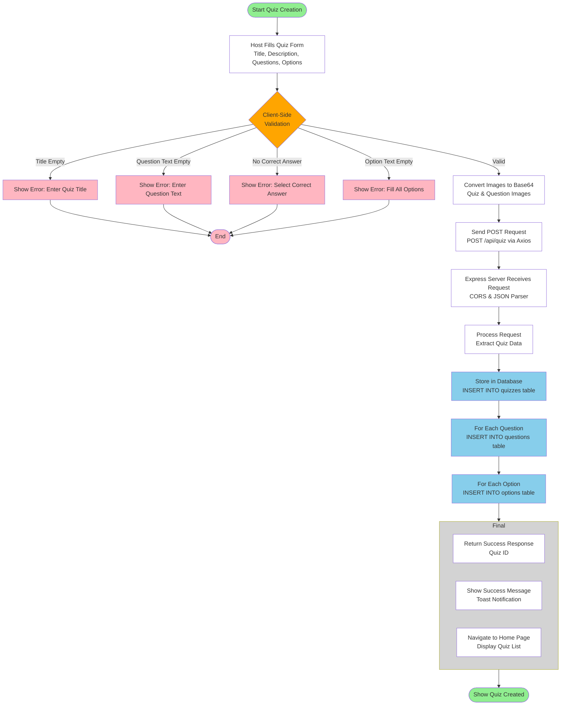

# Figure 4.3: Quiz Creation Workflow (Simplified)

## Overview

This diagram illustrates the essential steps in the quiz creation process, from user input to database storage, with clear error handling paths and decision points.

## Diagram Structure

**Shapes and Colors Legend:**
- **Ovals (Green)**: Start and End points of the workflow
- **Diamonds (Orange)**: Decision points for validation
- **Rectangles (White)**: General processing steps
- **Rectangles (Pink)**: Error handling steps that terminate the process
- **Rectangles (Light Blue)**: Database storage operations
- **Large Grey Rectangle**: A grouping container for related final steps



## Workflow Steps

### 1. Start Quiz Creation
- Host initiates quiz creation process
- Opens the Create Quiz page

### 2. Host Fills Quiz Form
- User fills out the quiz creation form
- Enters quiz title, description (optional)
- Adds questions with text and time limits
- Adds 4 answer options per question
- Marks one option as correct answer
- Optionally uploads images for quiz and questions

### 3. Client-Side Validation (Decision Point)
The system validates the form data with multiple checks:
- **Title Empty**: Shows error "Enter Quiz Title" → Process ends
- **Question Text Empty**: Shows error "Enter Question Text" → Process ends
- **No Correct Answer**: Shows error "Select Correct Answer" → Process ends
- **Option Text Empty**: Shows error "Fill All Options" → Process ends
- **Valid**: Proceeds to next step

### 4. Convert Images to Base64
- Converts quiz cover image to Base64 format (if provided)
- Converts question images to Base64 format (if provided)
- Prepares all data for API submission

### 5. Send POST Request
- **Method**: POST
- **Endpoint**: `/api/quiz`
- **Client**: Axios HTTP client
- **Payload**: JSON containing quiz data, questions, and options

### 6. Express Server Receives Request
- Server receives HTTP POST request
- CORS middleware validates origin
- JSON body parser extracts request data

### 7. Process Request
- Server extracts quiz data from request body
- Validates data structure (if server-side validation is implemented)

### 8. Store in Database - Quizzes Table
- Inserts quiz record into `quizzes` table
- Stores: title, description, image_url
- Gets auto-generated quiz ID

### 9. Store in Database - Questions Table
- For each question in the request:
  - Inserts question record into `questions` table
  - Stores: quiz_id, question_text, time_limit, order_index, image_url
  - Gets auto-generated question ID

### 10. Store in Database - Options Table
- For each option in each question:
  - Inserts option record into `options` table
  - Stores: question_id, option_text, is_correct, order_index, color

### 11. Final Steps (Grouped)
The final steps are executed in sequence:
- **Return Success Response**: Server returns HTTP 200 status with quiz object containing ID
- **Show Success Message**: Client displays success toast notification ("Quiz created successfully!")
- **Navigate to Home Page**: User is redirected to home page (`/`) where new quiz appears in the list

### 12. Show Quiz Created
- Process completes successfully
- User can see the newly created quiz in the quiz list

---

## Data Flow

```
User Input → Validation → Image Conversion → 
HTTP POST → Server → Database (Quizzes → Questions → Options) → 
Success Response → Client Update → Home Page
```

---

## Database Operations

### Step 1: Insert Quiz
```sql
INSERT INTO quizzes (title, description, image_url) 
VALUES ($1, $2, $3)
```

### Step 2: Insert Questions (Loop)
```sql
INSERT INTO questions (quiz_id, question_text, time_limit, order_index, image_url) 
VALUES ($1, $2, $3, $4, $5)
```

### Step 3: Insert Options (Nested Loop)
```sql
INSERT INTO options (question_id, option_text, is_correct, order_index, color) 
VALUES ($1, $2, $3, $4, $5)
```

---

## Key Components

| Component | Technology | Purpose |
|-----------|-----------|---------|
| **Frontend** | React + TypeScript | User interface and form handling |
| **HTTP Client** | Axios | Sends POST request to API |
| **Backend** | Express.js | Receives and processes requests |
| **Database** | PostgreSQL | Stores quiz, question, and option data |
| **Validation** | Client-side checks | Ensures data integrity before submission |

---

## Error Handling

- **Client Validation Errors**: Displayed as toast notifications, user stays on form
- **Server Errors**: Returned as HTTP error responses, displayed to user
- **Database Errors**: Caught by server, error message returned to client

