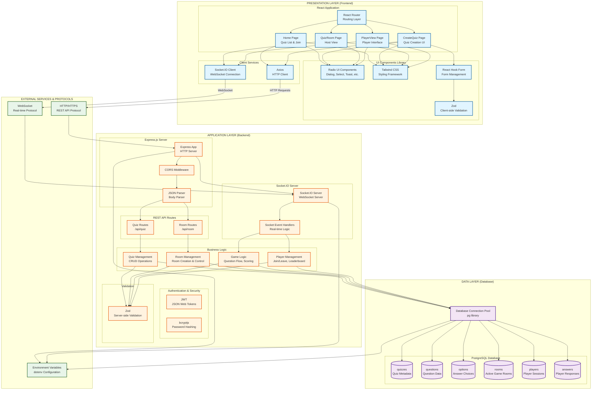

# Quiz App - System Architecture Diagram

## Three-Tier Architecture Overview

This document illustrates the detailed system architecture of the Quiz App, showing the three-tier architecture with presentation, application, and data layers, along with integration with external services.

## Component Relationships

### 1. Presentation Layer Components

#### **React Pages**
- **Home Page**: Displays available quizzes, allows joining rooms, and creating new quizzes
- **CreateQuiz Page**: Form-based interface for creating quizzes with questions and options
- **QuizRoom Page**: Host interface showing player list, quiz control, and leaderboard
- **PlayerView Page**: Player interface displaying questions, answer options, and real-time updates

#### **UI Components**
- **Radix UI**: Accessible component primitives (Dialog, Select, Toast, Label, etc.)
- **Tailwind CSS**: Utility-first CSS framework for styling
- **React Hook Form**: Form state management and validation
- **Zod**: Schema validation for form data

#### **Client Services**
- **Axios**: HTTP client for REST API communication
- **Socket.IO Client**: WebSocket client for real-time bidirectional communication

### 2. Application Layer Components

#### **HTTP Server (Express.js)**
- **Express App**: Main HTTP server handling REST API requests
- **CORS Middleware**: Enables cross-origin resource sharing
- **JSON Parser**: Parses JSON request bodies

#### **REST API Routes**
- **Quiz Routes** (`/api/quiz`):
  - `GET /` - Fetch all quizzes
  - `GET /:id` - Get quiz by ID with questions and options
  - `POST /` - Create new quiz
  - `DELETE /:id` - Delete quiz

- **Room Routes** (`/api/room`):
  - `POST /` - Create game room
  - `GET /:roomId` - Get room details with players

#### **Socket.IO Server**
- **WebSocket Server**: Handles real-time connections
- **Event Handlers**:
  - `host:join` - Host joins room
  - `player:join` - Player joins room
  - `quiz:start` - Start quiz session
  - `answer:submit` - Player submits answer
  - `host:leave` - Host leaves room
  - `player:leave` - Player leaves room
  - `disconnect` - Handle disconnections

#### **Business Logic Modules**
- **Quiz Management**: CRUD operations for quizzes, questions, and options
- **Room Management**: Room creation, activation, and lifecycle management
- **Game Logic**: Question flow control, timing, answer validation, scoring
- **Player Management**: Player registration, score tracking, leaderboard updates

#### **Security & Validation**
- **JWT**: Token-based authentication (configured but may be extended)
- **bcryptjs**: Password hashing for user authentication
- **Zod**: Server-side schema validation for request data

### 3. Data Layer Components

#### **PostgreSQL Database Tables**

1. **quizzes**
   - Stores quiz metadata (title, description, image_url)
   - Primary key: `id`

2. **questions**
   - Stores question data (text, type, time_limit, order_index, image_url)
   - Foreign key: `quiz_id` → quizzes.id

3. **options**
   - Stores answer choices (text, is_correct, color, order_index)
   - Foreign key: `question_id` → questions.id

4. **rooms**
   - Stores active game rooms (room_id, quiz_id, host_id, is_active, current_question)
   - Primary key: `id` (6-character code)
   - Foreign key: `quiz_id` → quizzes.id

5. **players**
   - Stores player sessions (room_id, player_name, socket_id, score)
   - Foreign key: `room_id` → rooms.id

6. **answers**
   - Stores player responses (room_id, question_id, player_id, option_id, is_correct, time_taken)
   - Foreign keys: `room_id` → rooms.id, `question_id` → questions.id, `player_id` → players.id, `option_id` → options.id

#### **Database Connection**
- **pg (node-postgres)**: PostgreSQL client library
- **Connection Pool**: Manages database connections efficiently

### 4. External Services & Protocols

- **HTTP/HTTPS**: REST API communication protocol
- **WebSocket**: Real-time bidirectional communication protocol
- **Environment Variables**: Configuration management via dotenv

## Data Flow

### Quiz Creation Flow
1. User fills form in **CreateQuiz Page**
2. Form validated with **Zod** (client-side)
3. **Axios** sends POST request to `/api/quiz`
4. **Express** receives request, validates with **Zod** (server-side)
5. **Quiz Management** logic processes request
6. Data persisted in **PostgreSQL** (quizzes, questions, options tables)
7. Response sent back to client

### Real-time Game Flow
1. Host creates room via REST API
2. Host connects via **Socket.IO Client** → **Socket.IO Server**
3. Players join room via **Socket.IO Client** → **Socket.IO Server**
4. Host starts quiz → **Game Logic** module
5. Questions broadcast to all players via WebSocket
6. Players submit answers → **Game Logic** processes and scores
7. Leaderboard updated in real-time
8. All data persisted in **PostgreSQL** (rooms, players, answers tables)

## Technology Stack Summary

### Frontend
- React 18.2.0
- TypeScript 5.2.2
- Vite 5.0.8
- React Router DOM 6.20.1
- Tailwind CSS 3.3.6
- Radix UI Components
- Socket.IO Client 4.5.4
- Axios 1.6.2

### Backend
- Node.js
- Express 4.18.2
- TypeScript 5.3.3
- Socket.IO 4.5.4
- PostgreSQL (via pg 8.11.3)
- JWT 9.0.2
- bcryptjs 2.4.3
- Zod 3.22.4

### Infrastructure
- PostgreSQL Database
- WebSocket Protocol
- HTTP/HTTPS Protocol

